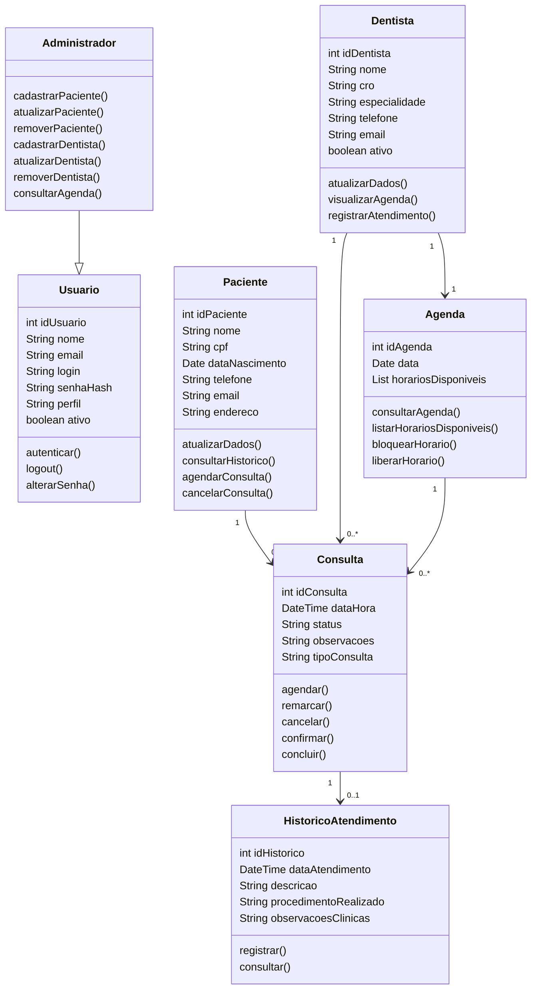

# 3. DOCUMENTO DE ESPECIFICAÇÃO DE REQUISITOS DE SOFTWARE

Esta seção apresenta a especificação dos requisitos do sistema proposto, descrevendo suas funcionalidades, restrições, usuários e modelagem, com o objetivo de orientar o desenvolvimento da plataforma web para gestão de agendamentos em clínicas odontológicas.

---

## 3.1 Objetivos deste documento

Descrever e especificar as necessidades de uma clínica odontológica no que se refere ao agendamento de consultas, organização de agendas e gerenciamento de pacientes, que devem ser atendidas pelo sistema proposto.

---

## 3.2 Escopo do produto

### 3.2.1 Nome do produto e seus componentes principais

O produto será denominado **SGACO – Sistema de Gestão de Agendamentos para Clínicas Odontológicas**.

Componentes principais:
- Módulo de agendamento de consultas  
- Módulo de gerenciamento de pacientes  
- Módulo de gerenciamento de agendas  

---

### 3.2.2 Missão do produto

Facilitar o agendamento de consultas odontológicas e otimizar o gerenciamento das agendas dos profissionais, promovendo maior eficiência e melhor comunicação com os pacientes.

---

### 3.2.3 Limites do produto

O sistema **não contempla**:
- Pagamentos ou faturamento  
- Prontuário clínico detalhado  
- Integrações externas (convênios, ERPs)  

---

### 3.2.4 Benefícios do produto

| # | Benefício | Valor |
|---|----------|------|
| 1 | Agendamento online | Essencial |
| 2 | Organização da agenda | Essencial |
| 3 | Redução de erros | Essencial |
| 4 | Melhor comunicação | Recomendável |

---

## 3.3 Descrição geral do produto

### 3.3.1 Requisitos Funcionais

| Código | Requisito Funcional | Descrição |
|-------|-------|-------|
| RF1 | Fazer login | Login com autenticação |
| RF2 | Gerenciar pacientes | Processamento de Inclusão, Alteração, Exclusão e Consulta de informações de pacientes |
| RF3 | Gerenciar dentistas | Processamento de Inclusão, Alteração, Exclusão e Consulta de informações sobre profissionais (dentistas) |
| RF4 | Gerenciar agendamentos | Remarcar, cancelar e consultar agendamentos/consultas; incluir consulta de horários disponíveis |
| RF5 | Registrar histórico de atendimentos | Armazenar informações das consultas realizadas para cada paciente |

---

### 3.3.2 Requisitos Não Funcionais

| Código | Requisito Não Funcional |
|----- | ----|
| RNF1 | O sistema deve suportar navegadores web modernos (Chrome, Firefox, Edge) |
| RNF2 | O sistema deve ser responsivo, adaptar interface a diferentes dispositivos (desktop, tablet, smartphone) |
| RNF3 | O sistema deve proteger o acesso por autenticação de usuários |
| RNF4 | O sistema deve responder às requisições em até 3 segundos |

---

### 3.3.3 Usuários

| Ator | Descrição |
|------|----------|
| Paciente | Agenda consultas |
| Dentista | Visualiza agenda |
| Administrador | Gerencia sistema |

---

## 3.4 Modelagem do Sistema

### 3.4.1 Diagrama de Casos de Uso

### 3.4.2 Descrição de Caso de Uso
#### CSU01 – Fazer Login
**Ator Primário:** Paciente / Dentista / Administrador

**Fluxo Principal:**
1. Usuário realiza o login com autenticação
2. Usuário realiza o logout
3. Usuário altera senha

**Fluxos Alternativos:**
- Usuário realiza o cadastro

---

#### CSU02 – Gerenciar Pacientes
**Ator Primário:** Administrador
**Incluso:** CSU01 – Fazer Login

**Fluxo Principal:**
1. Administrador cadastra pacientes
2. Administrador atualiza dados de pacientes

**Fluxos Alternativos:**
- Administrador remove dados de pacientes

---

#### CSU03 – Gerenciar Dentistas
**Ator Primário:** Administrador
**Incluso:** CSU01 – Fazer Login

**Fluxo Principal:**
1. Administrador cadastra dentista
2. Administrador atualiza dados sobre dentista

**Fluxos Alternativos:**
- Administrador remove dentista do sistema

---

#### CSU04 – Gerenciar Agendamentos
**Ator Primário:** Paciente / Administrador / Dentista
**Incluso:** CSU01 – Fazer Login (Exceto consulta de horários)

**Fluxo Principal:**
1. Administrador e dentista consultam agendamentos
2. Paciente agenda consulta
3. Paciente cancela consulta
4. Administrador lista horários disponíveis no sistema
5. Administrador remarca consulta
6. Administrador confirma consulta
7. Dentista conclui atendimento

**Fluxos Alternativos:**
- Administrador bloqueia horários
- Administrador libera horários
- Administrador e dentista cancelam consulta
- Administrador e dentista agendam consulta
- Paciente remarca consulta

---

#### CSU05 – Registrar Histórico de Atendimentos
**Ator Primário:** Administrador / Dentista
**Incluso:** CSU01 – Fazer Login

**Fluxo Principal:**
1. Administrador ou Dentista registra o atendimento
2. Administrador ou Dentista consulta histórico de atendimentos

## 3.4.3 Diagrama de Classes

---

| # | Classe | Descrição |
|---|--------|----------|
| 1 | Usuario | Representa o usuário autenticado do sistema, contendo dados de acesso e controle de perfil |
| 2 | Administrador | Especialização de usuário com permissão para gerenciar pacientes, dentistas e agendas |
| 3 | Paciente | Armazena os dados cadastrais dos pacientes da clínica e permite operações relacionadas ao agendamento |
| 4 | Dentista | Representa os profissionais da clínica, com seus dados cadastrais e vínculo com a agenda |
| 5 | Consulta | Representa os agendamentos realizados entre pacientes e dentistas, contendo data, horário, status e observações |
| 6 | Agenda | Organiza os horários disponíveis e as consultas associadas a cada dentista |
| 7 | HistoricoAtendimento | Registra informações básicas sobre atendimentos já realizados |
