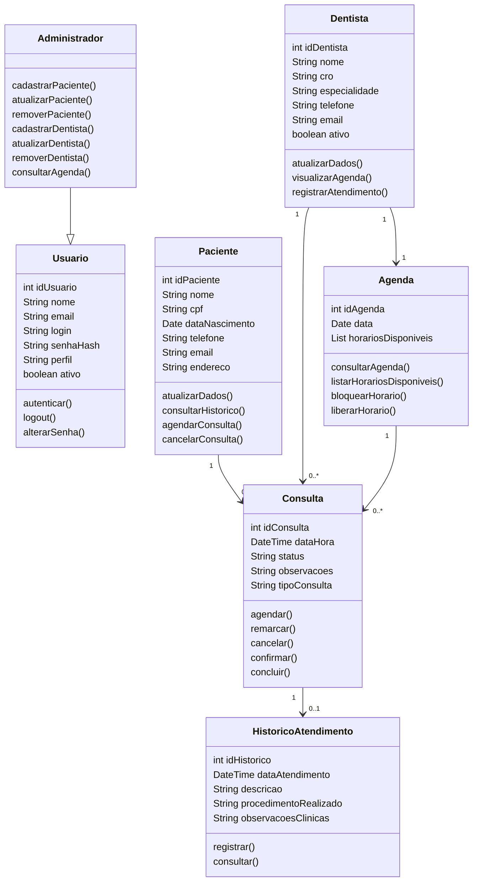

# 3. DOCUMENTO DE ESPECIFICAÇÃO DE REQUISITOS DE SOFTWARE

Esta seção apresenta a especificação dos requisitos do sistema proposto, descrevendo suas funcionalidades, restrições, usuários e modelagem, com o objetivo de orientar o desenvolvimento da plataforma web para gestão de agendamentos em clínicas odontológicas.

---

## 3.1 Objetivos deste documento

Descrever e especificar as necessidades de uma clínica odontológica no que se refere ao agendamento de consultas, organização de agendas e gerenciamento de pacientes, que devem ser atendidas pelo sistema proposto.

---

## 3.2 Escopo do produto

### 3.2.1 Nome do produto e seus componentes principais

O produto será denominado **SGACO – Sistema de Gestão de Agendamentos para Clínicas Odontológicas**.

Componentes principais:
- Módulo de agendamento de consultas  
- Módulo de gerenciamento de pacientes  
- Módulo de gerenciamento de agendas  

---

### 3.2.2 Missão do produto

Facilitar o agendamento de consultas odontológicas e otimizar o gerenciamento das agendas dos profissionais, promovendo maior eficiência e melhor comunicação com os pacientes.

---

### 3.2.3 Limites do produto

O sistema **não contempla**:
- Pagamentos ou faturamento  
- Prontuário clínico detalhado  
- Integrações externas (convênios, ERPs)  

---

### 3.2.4 Benefícios do produto

| # | Benefício | Valor |
|---|----------|------|
| 1 | Agendamento online | Essencial |
| 2 | Organização da agenda | Essencial |
| 3 | Redução de erros | Essencial |
| 4 | Melhor comunicação | Recomendável |

---

## 3.3 Descrição geral do produto

### 3.3.1 Requisitos Funcionais

| Código | Requisito Funcional | Descrição |

---

### 3.3.2 Requisitos Não Funcionais

| Código | Requisito Não Funcional | Descrição |
|--------|------------------------|----------|
| RNF1 | O sistema deve suportar navegadores web modernos | Garantir funcionamento em Chrome, Firefox e Edge |
| RNF2 | O sistema deve adaptar a interface a diferentes dispositivos | Permitir uso em desktop, tablet e smartphone |
| RNF3 | O sistema deve proteger o acesso por autenticação de usuários | Garantir login seguro com usuário e senha |
| RNF4 | O sistema deve responder às requisições em até 3 segundos | Garantir desempenho adequado nas operações |
| RNF5 | O sistema deve apresentar interface intuitiva | Facilitar o uso por usuários com diferentes níveis de experiência |
| RNF6 | O sistema deve garantir a integridade dos dados | Evitar inconsistências e perda de informações |
| RNF7 | O sistema deve manter disponibilidade durante o horário de funcionamento | Garantir acesso contínuo ao sistema |
| RNF8 | O sistema deve permitir manutenção e atualização | Facilitar correções e melhorias no sistema |

---

### 3.3.3 Usuários

| Ator | Descrição |
|------|----------|
| Paciente | Agenda consultas |
| Dentista | Visualiza agenda |
| Administrador | Gerencia sistema |

---

## 3.4 Modelagem do Sistema

### 3.4.1 Diagrama de Casos de Uso

### 3.4.2 Descrição de Caso de Uso

#### CSU01 – Gerenciar Agendamento

**Ator Primário:** Paciente  
**Ator Secundário:** Funcionário 

**Fluxo Principal:**
1. Usuário acessa sistema  
2. Visualiza horários disponíveis  
3. Seleciona data/hora  
4. Confirma agendamento  
5. Sistema registra

**Fluxos Alternativos:**
- Cancelamento  
- Remarcação  

---

## 3.4.3 Diagrama de Classes

---

| # | Classe | Descrição |
|---|--------|----------|
| 1 | Usuario | Representa o usuário autenticado do sistema, contendo dados de acesso e controle de perfil |
| 2 | Administrador | Especialização de usuário com permissão para gerenciar pacientes, dentistas e agendas |
| 3 | Paciente | Armazena os dados cadastrais dos pacientes da clínica e permite operações relacionadas ao agendamento |
| 4 | Dentista | Representa os profissionais da clínica, com seus dados cadastrais e vínculo com a agenda |
| 5 | Consulta | Representa os agendamentos realizados entre pacientes e dentistas, contendo data, horário, status e observações |
| 6 | Agenda | Organiza os horários disponíveis e as consultas associadas a cada dentista |
| 7 | HistoricoAtendimento | Registra informações básicas sobre atendimentos já realizados |
