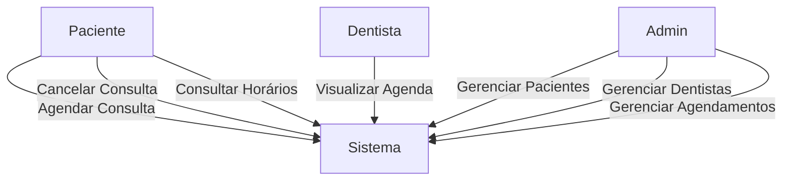
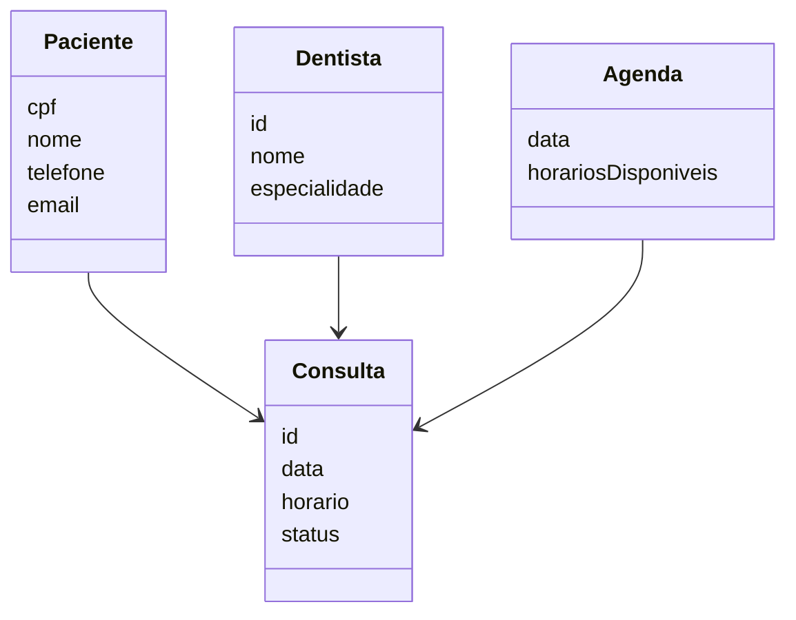

# 3. DOCUMENTO DE ESPECIFICAÇÃO DE REQUISITOS DE SOFTWARE

Esta seção apresenta a especificação dos requisitos do sistema proposto, descrevendo suas funcionalidades, restrições, usuários e modelagem, com o objetivo de orientar o desenvolvimento da plataforma web para gestão de agendamentos em clínicas odontológicas.

---

## 3.1 Objetivos deste documento

Descrever e especificar as necessidades de uma clínica odontológica no que se refere ao agendamento de consultas, organização de agendas e gerenciamento de pacientes, que devem ser atendidas pelo sistema proposto.

---

## 3.2 Escopo do produto

### 3.2.1 Nome do produto e seus componentes principais

O produto será denominado **SGACO – Sistema de Gestão de Agendamentos para Clínicas Odontológicas**.

Componentes principais:
- Módulo de agendamento de consultas  
- Módulo de gerenciamento de pacientes  
- Módulo de gerenciamento de agendas  

---

### 3.2.2 Missão do produto

Facilitar o agendamento de consultas odontológicas e otimizar o gerenciamento das agendas dos profissionais, promovendo maior eficiência e melhor comunicação com os pacientes.

---

### 3.2.3 Limites do produto

O sistema **não contempla**:
- Pagamentos ou faturamento  
- Prontuário clínico detalhado  
- Integrações externas (convênios, ERPs)  

---

### 3.2.4 Benefícios do produto

| # | Benefício | Valor |
|---|----------|------|
| 1 | Agendamento online | Essencial |
| 2 | Organização da agenda | Essencial |
| 3 | Redução de erros | Essencial |
| 4 | Melhor comunicação | Recomendável |

---

## 3.3 Descrição geral do produto

### 3.3.1 Requisitos Funcionais

| Código | Requisito | Descrição |
|--------|----------|----------|
| RF1 | Gerenciar Pacientes | CRUD de pacientes |
| RF2 | Gerenciar Agendamentos | Agendar, cancelar, remarcar |
| RF3 | Visualizar Agenda | Exibir horários |
| RF4 | Gerenciar Dentistas | CRUD de profissionais |
| RF5 | Login | Autenticação de usuários |
| RF6 | Horários Disponíveis | Consulta de horários livres |
| RF7 | Histórico | Registro de atendimentos |

---

### 3.3.2 Requisitos Não Funcionais

| Código | Requisito |
|--------|----------|
| RNF1 | Sistema web (browser) |
| RNF2 | Interface responsiva |
| RNF3 | Autenticação segura |
| RNF4 | Tempo de resposta < 3s |
| RNF5 | Interface intuitiva |

---

### 3.3.3 Usuários

| Ator | Descrição |
|------|----------|
| Paciente | Agenda consultas |
| Dentista | Visualiza agenda |
| Administrador | Gerencia sistema |

---

## 3.4 Modelagem do Sistema

### 3.4.1 Diagrama de Casos de Uso

---

### 3.4.2 Descrição de Caso de Uso

#### CSU01 – Gerenciar Agendamento

**Ator Primário:** Paciente  
**Ator Secundário:** Administrador  

**Fluxo Principal:**
1. Usuário acessa sistema  
2. Visualiza horários disponíveis  
3. Seleciona data/hora  
4. Confirma agendamento  
5. Sistema registra  

**Fluxos Alternativos:**
- Cancelamento  
- Remarcação  

---

## 3.4.3 Diagrama de Classes

---

## 3.4.4 Descrição das Classes

| # | Classe | Descrição |
|---|--------|----------|
| 1 | Paciente | Dados do paciente |
| 2 | Dentista | Dados do profissional |
| 3 | Consulta | Agendamentos |
| 4 | Agenda | Controle de horários |
| 5 | Usuário | Login e autenticação |
